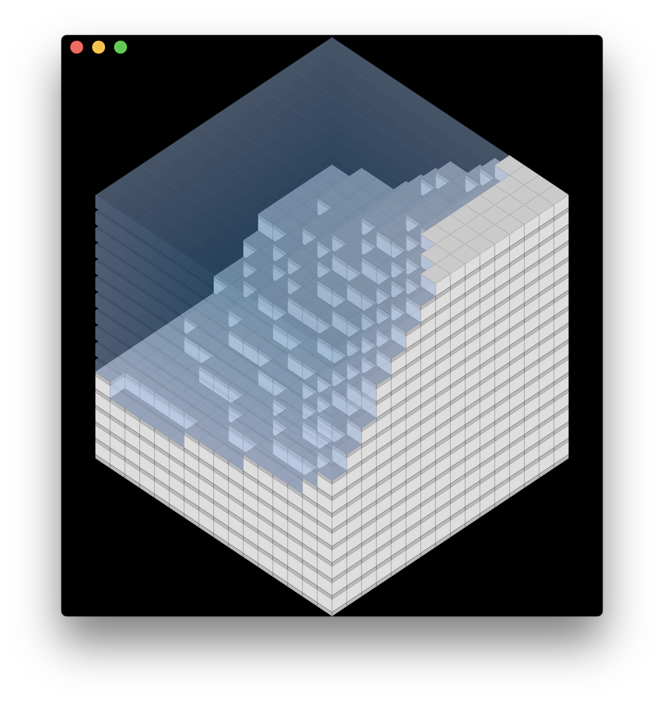

# Xcode-MacOS-Metal-Example

This project is an example of how to setup and use Apple's Metal graphics API on macOS.
It currently renders a 3D Isometric scene using 2D sprites and water with a depth effect.

	

